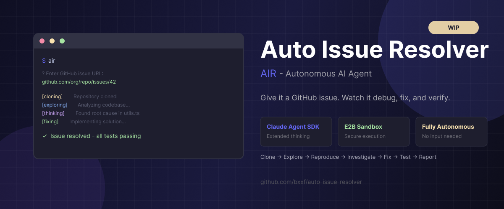

# WIP: Auto Issue Resolver (AIR)

> **This project is a work in progress.** Features may be incomplete, APIs may change, and there will be bugs. Contributions and feedback welcome!



---

## The Origin Story

I was working on a side project ([vibecode-arena](https://github.com/bxxf/vibecode-arena)) that uses [E2B](https://e2b.dev) for sandboxed code execution. While trying to deploy a custom template, I stumbled upon a bug related to file paths in ESM modules. So I did what any developer would do - went to create an issue explaining exactly what was wrong, including the root cause, the expected behavior, and how to reproduce it.

Then I had to create the PR to fix it.

And that's when it hit me: **the issue itself contained everything needed to generate the fix.** The bug description, the expected behavior, the reproduction steps - all the information an experienced developer would need was already there.

So I wondered: could an AI agent take a well-written GitHub issue and autonomously produce a working fix?

I'm not sure if this already exists. But I'm building it anyway.

---

## What is Auto Issue Resolver?

**AIR** is an autonomous agent that attempts to fix GitHub issues without human intervention. Unlike quick-fix tools, AIR takes its time - it can spend minutes or even hours methodically exploring a codebase, understanding the context, and reasoning through complex problems until it truly grasps what's going wrong.

You give it a GitHub issue URL, and it:

1. **Clones** the repository into an isolated cloud sandbox
2. **Analyzes** the issue to understand the problem
3. **Explores** the codebase to find relevant code
4. **Reproduces** the bug (if applicable)
5. **Investigates** the root cause
6. **Implements** a fix
7. **Verifies** the fix with tests
8. **Reports** its findings with a structured summary

All of this happens in a secure, isolated [E2B](https://e2b.dev) sandbox - so the agent can't accidentally (or intentionally) mess with your local machine.

---

## Example: Solving a Real Bug

I re-published the E2B repo with the original bug here: [e2b-before-fix](https://github.com/bxxf/e2b-beforefix-air-test). The repo includes the issue that describes the bug: [Issue #1](https://github.com/bxxf/e2b-beforefix-air-test/issues/1). I intentionally removed some details from the issue to make it more challenging - the agent doesn't get the solution handed to it.

<video src="./imgs/demo.mp4" controls width="100%"></video>

---

## Why This is Exciting

- **Well-written issues are half the solution.** If an issue clearly describes the problem, the fix often writes itself. AIR automates that last step.

- **Secure by design.** All code execution happens in E2B cloud sandboxes. The agent has zero access to your local filesystem.

- **Extended thinking.** Powered by Claude's reasoning capabilities, the agent can work through complex debugging scenarios step by step.

- **Full visibility.** Watch the agent think in real-time - see its reasoning, tool calls, and decision-making process.

---

## Getting Started

### Prerequisites

- [Bun](https://bun.sh) (v1.2+) or [Node.js](https://nodejs.org) (v20+)

### API Keys Required

You'll need API keys from:
- [Anthropic](https://console.anthropic.com/) - for Claude
- [GitHub](https://github.com/settings/tokens) - for repository access
- [E2B](https://e2b.dev/) - for cloud sandboxes

### Installation

```bash
# Clone the repo
git clone https://github.com/bxxf/auto-issue-resolver.git
cd auto-issue-resolver

# Install dependencies
bun install

# Copy environment template
cp .env.example .env

# Edit .env with your API keys
```

### Configuration

Edit `.env` with your API keys:

```bash
# Required
GITHUB_TOKEN=ghp_...
ANTHROPIC_API_KEY=sk-ant-...
E2B_API_KEY=e2b_...

# Optional (defaults shown)
E2B_TIMEOUT_MS=600000
AGENT_DEFAULT_MODEL=claude-sonnet-4.5-20250929
```

### CLI Usage

```bash
# Build the project
bun run build

# Run interactively
bun run air

# Or with issue URL directly
bun run air https://github.com/owner/repo/issues/123
```

Then paste a GitHub issue URL when prompted (e.g., `https://github.com/owner/repo/issues/123`).

### Programmatic Usage

```typescript
import { runAgent } from "@bxxf/air-agent";
import { parseIssueUrl, createGitHubClient } from "@bxxf/air-core";

// Fetch issue details
const github = createGitHubClient({ token: process.env.GITHUB_TOKEN! });
const parsed = parseIssueUrl("https://github.com/owner/repo/issues/123");
if (!parsed.ok) throw new Error(parsed.error.message);

const [issue, repo] = await Promise.all([
  github.fetchIssue(parsed.value),
  github.fetchRepo(parsed.value),
]);

if (!issue.ok || !repo.ok) throw new Error("Failed to fetch issue/repo");

// Run the agent
const result = await runAgent({
  issue: issue.value,
  repo: repo.value,
  config: {
    model: "claude-sonnet-4.5-20250929",
    maxThinkingTokens: 10000,
    interactive: false,
  },
  sandboxConfig: {
    apiKey: process.env.E2B_API_KEY!,
    timeoutMs: 600000,
    githubToken: process.env.GITHUB_TOKEN,
  },
  onEvent: (event) => {
    switch (event.type) {
      case "tool_call":
        console.log(`Tool: ${event.tool}`);
        break;
      case "message":
        console.log(`Agent: ${event.content}`);
        break;
      case "ask_user":
        // Agent needs user input
        console.log(`Question: ${event.question}`);
        event.resolve("your answer here");
        break;
      case "complete":
        console.log("Done!", event.report.status);
        break;
    }
  },
});

if (result.ok) {
  console.log("Report:", result.value);
} else {
  console.error("Error:", result.error);
}
```

---

### How It Works

1. **CLI** (`apps/cli`) provides the interactive terminal interface
2. **Agent** (`packages/agent`) orchestrates the issue resolution using Claude Agent SDK
3. **MCP Server** (`packages/mcp-e2b`) exposes E2B sandbox operations as tools Claude can use
4. **Core** (`packages/core`) provides shared config, types, and GitHub client

---

## Sandbox Tools

| Tool | Description |
|------|-------------|
| `sandbox_clone` | Clone a GitHub repository |
| `sandbox_exec` | Execute shell commands (npm, tests, etc.) |
| `sandbox_read` | Read file contents |
| `sandbox_write` | Write/overwrite entire file |
| `sandbox_edit` | Replace string in file (surgical edits) |
| `sandbox_ls` | List directory contents |
| `sandbox_grep` | Search files with regex |
| `sandbox_git_log` | Check recent commits |
| `sandbox_git_checkout` | Switch to specific commit/branch |
| `sandbox_bisect` | Git bisect to find bad commit |
| `sandbox_browser` | Navigate URL + screenshot (for UI bugs) |
| `sandbox_url` | Get public URL for testing web servers |
| `ask_user` | Ask user for input when stuck |

---

## Tech Stack

| Layer | Technology |
|-------|------------|
| **AI** | [Claude Agent SDK](https://github.com/anthropics/claude-code) with extended thinking |
| **Sandbox** | [E2B](https://e2b.dev) cloud sandboxes for secure code execution |
| **CLI** | [Ink](https://github.com/vadimdemedes/ink) (React for the terminal) |
| **Build** | [Turborepo](https://turbo.build/repo) monorepo with [Bun](https://bun.sh) |
| **Language** | TypeScript (ESM) |
| **Validation** | [Zod](https://zod.dev) for runtime type safety |

---

## Current Limitations

This is a work in progress. Known limitations:

- **No PR creation yet** - The agent can fix code but doesn't create pull requests (coming soon)
- **Single-issue focus** - Can't batch process multiple issues
- **No persistent memory** - Each run starts fresh
- **Model-dependent quality** - Results vary based on issue clarity and codebase complexity

---

## Roadmap

- [ ] Automatic PR creation with fix and comments in the issue
- [ ] Multi-agent architecture - spawn multiple agents to explore different parts of the codebase in parallel
- [ ] Efficiency & speed - optimize how the agent navigates codebases, reducing token usage and time-to-fix
- [ ] GitHub webhook integration - automatically process new issues
- [ ] Web UI alternative to CLI to monitor progress / view reports
- [ ] Batch processing of multiple issues
- [ ] Persistent agent memory across sessions

---

## Contributing

This is an experimental project. If you find it interesting:

1. Try it out and report bugs
2. Suggest features via issues
3. Submit PRs for improvements

---

## License

MIT

---

*Built with curiosity and Claude.*
