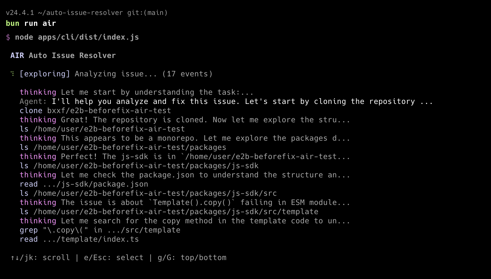
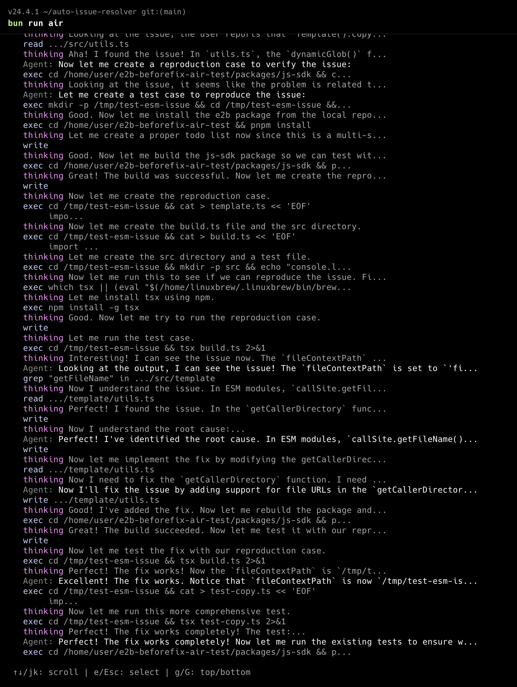
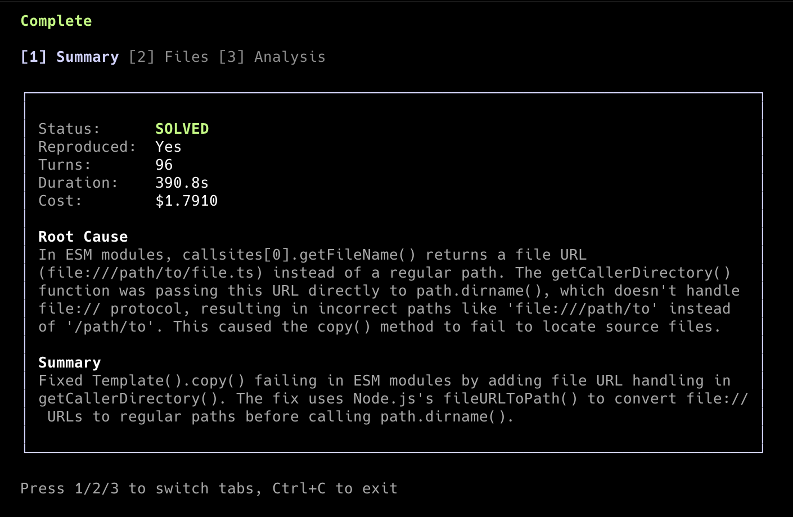

# WIP: Auto Issue Resolver (AIR)

> **This project is a work in progress.** Features may be incomplete, APIs may change, and there will be bugs. Contributions and feedback welcome!


---

## The Origin Story

I was working on a side project ([vibecode-arena](https://github.com/bxxf/vibecode-arena)) that uses [E2B](https://e2b.dev) for sandboxed code execution. While trying to deploy a custom template, I stumbled upon a bug related to file paths in ESM modules. So I did what any developer would do - went to create an issue explaining exactly what was wrong, including the root cause, the expected behavior, and how to reproduce it.

Then I had to create the PR to fix it.

And that's when it hit me: **the issue itself contained everything needed to generate the fix.** The bug description, the expected behavior, the reproduction steps - all the information an experienced developer would need was already there.

So I wondered: could an AI agent take a well-written GitHub issue and autonomously produce a working fix?

I'm not sure if this already exists. But I'm building it anyway.

---

## What is Auto Issue Resolver?

**AIR** is an autonomous agent that attempts to fix GitHub issues without human intervention. Unlike quick-fix tools, AIR takes its time - it can spend minutes or even hours methodically exploring a codebase, understanding the context, and reasoning through complex problems until it truly grasps what's going wrong.

You give it a GitHub issue URL, and it:

1. **Clones** the repository into an isolated cloud sandbox
2. **Analyzes** the issue to understand the problem
3. **Explores** the codebase to find relevant code
4. **Reproduces** the bug (if applicable)
5. **Investigates** the root cause
6. **Implements** a fix
7. **Verifies** the fix with tests
8. **Reports** its findings with a structured summary

All of this happens in a secure, isolated [E2B](https://e2b.dev) sandbox - so the agent can't accidentally (or intentionally) mess with your local machine.

---

## Example: Solving a Real Bug

I re-published the E2B repo with the original bug here: [e2b-before-fix](https://github.com/bxxf/e2b-beforefix-air-test). The repo includes the issue that describes the bug: [Issue #1](https://github.com/bxxf/e2b-beforefix-air-test/issues/1). I intentionally removed some details from the issue to make it more challenging - the agent doesn't get the solution handed to it.





**What the agent did autonomously:**

1. **Cloned the repo** and explored the project structure
2. **Created a reproduction case** - wrote a minimal test script to trigger the ESM file path bug
3. **Identified the root cause** - traced the issue to `getCallerDirectory` returning `file://` URLs instead of proper paths in ESM modules
4. **Implemented the fix** - modified `utils.ts` to handle file URLs by stripping the `file://` prefix
5. **Verified the fix** - ran the reproduction case again to confirm it works
6. **Ran existing tests** - executed the test suite to ensure no regressions
7. **Created additional tests** - wrote new ESM-specific tests to validate the fix edge cases

All of this happened without human intervention. The agent spent ~7 minutes methodically working through the problem, making hypotheses, testing them, and iterating until it found a working solution.

## Why This is Exciting

- **Well-written issues are half the solution.** If an issue clearly describes the problem, the fix often writes itself. AIR automates that last step.

- **Secure by design.** All code execution happens in E2B cloud sandboxes. The agent has zero access to your local filesystem.

- **Extended thinking.** Powered by Claude's reasoning capabilities, the agent can work through complex debugging scenarios step by step.

- **Full visibility.** Watch the agent think in real-time - see its reasoning, tool calls, and decision-making process.

---

## Tech Stack

| Layer | Technology |
|-------|------------|
| **AI** | [Claude Agent SDK](https://github.com/anthropics/claude-code) with extended thinking |
| **Sandbox** | [E2B](https://e2b.dev) cloud sandboxes for secure code execution |
| **CLI** | [Ink](https://github.com/vadimdemedes/ink) (React for the terminal) |
| **Build** | [Turborepo](https://turbo.build/repo) monorepo with [Bun](https://bun.sh) |
| **Language** | TypeScript (ESM) - for the fast prototyping |
| **Validation** | [Zod](https://zod.dev) for runtime type safety |

---

## Architecture

```
auto-issue-resolver/
├── apps/
│   └── cli/                        # Interactive terminal UI (Ink)
│       └── src/
│           ├── components/         # React components for terminal UI
│           │   ├── App.tsx         # Main app orchestration
│           │   ├── AgentView.tsx   # Agent event display
│           │   ├── Results.tsx     # Results display
│           │   ├── ToolCall.tsx    # Tool call formatting
│           │   └── ...
│           └── index.tsx           # Entry point
│
├── packages/
│   ├── agent/                      # Issue resolver agent
│   │   └── src/
│   │       ├── agent/              # Agent core logic
│   │       │   ├── runner.ts       # Main query execution
│   │       │   ├── report.ts       # Report parsing & building
│   │       │   └── messages.ts     # Message processing
│   │       └── prompts.ts          # System prompts & issue formatting
│   │
│   ├── core/                       # Shared utilities & types
│   │   └── src/
│   │       ├── types/              # TypeScript types (modular)
│   │       │   ├── branded.ts      # Branded types (IssueNumber, etc.)
│   │       │   ├── result.ts       # Result<T,E> pattern
│   │       │   ├── github.ts       # GitHub-related types
│   │       │   ├── agent.ts        # Agent types
│   │       │   └── sandbox.ts      # Sandbox types
│   │       ├── errors/             # Error classes (modular)
│   │       │   ├── base.ts         # Base AppError class
│   │       │   ├── config.ts       # Config errors
│   │       │   ├── github.ts       # GitHub errors
│   │       │   ├── sandbox.ts      # Sandbox errors
│   │       │   └── agent.ts        # Agent errors
│   │       ├── config.ts           # Environment configuration
│   │       ├── github.ts           # GitHub API client
│   │       └── logger.ts           # Logging utility
│   │
│   └── mcp-e2b/                    # E2B sandbox as MCP server
│       └── src/
│           ├── sandbox/            # Sandbox operations (modular)
│           │   ├── manager.ts      # Sandbox lifecycle
│           │   ├── repo.ts         # Git operations
│           │   ├── files.ts        # File operations
│           │   └── commands.ts     # Command execution
│           └── tools.ts            # MCP tool definitions
```

### How It Works

1. **CLI** (`apps/cli`) provides the interactive terminal interface
2. **Agent** (`packages/agent`) orchestrates the issue resolution using Claude Agent SDK
3. **MCP Server** (`packages/mcp-e2b`) exposes E2B sandbox operations as tools Claude can use
4. **Core** (`packages/core`) provides shared config, types, and GitHub client

The agent uses **MCP (Model Context Protocol)** to interact with the sandbox. This means Claude doesn't have direct filesystem access - it can only use the sandboxed tools we expose.

---

## Getting Started

### Prerequisites

- [Bun](https://bun.sh) (v1.2+)
- [Node.js](https://nodejs.org) (v20+)

### API Keys Required

You'll need API keys from:
- [Anthropic](https://console.anthropic.com/) - for Claude
- [GitHub](https://github.com/settings/tokens) - for repository access
- [E2B](https://e2b.dev/) - for cloud sandboxes

### Installation

```bash
# Clone the repo
git clone https://github.com/your-username/auto-issue-resolver.git
cd auto-issue-resolver

# Install dependencies
bun install

# Copy environment template
cp .env.example .env

# Edit .env with your API keys
```

### Configuration

Edit `.env` with your API keys:

```bash
# Required
GITHUB_TOKEN=ghp_...
ANTHROPIC_API_KEY=sk-ant-...
E2B_API_KEY=e2b_...

# Optional (defaults shown)
AGENT_MAX_TURNS=50
E2B_TIMEOUT_MS=600000
AGENT_DEFAULT_MODEL=claude-sonnet-4.5-20250929
```

### Usage

```bash
# Build the project
bun run build

# Run the CLI
bun run air
```

Then paste a GitHub issue URL when prompted (e.g., `https://github.com/owner/repo/issues/123`).

---

## Sandbox Tools

The agent has access to these sandboxed operations:

| Tool | Description |
|------|-------------|
| `sandbox_clone` | Clone a GitHub repository |
| `sandbox_exec` | Execute shell commands (npm, tests, etc.) |
| `sandbox_read` | Read file contents |
| `sandbox_write` | Create or modify files |
| `sandbox_ls` | List directory contents |
| `sandbox_grep` | Search files with regex |
| `sandbox_url` | Get public URL for testing web servers |
| `sandbox_git_log` | Check recent commits |
| `sandbox_git_checkout` | Switch to specific commit/branch |

---

## Current Limitations

This is a work in progress. Known limitations:

- **No PR creation yet** - The agent can fix code but doesn't create pull requests (coming soon)
- **Single-issue focus** - Can't batch process multiple issues
- **No persistent memory** - Each run starts fresh
- **Model-dependent quality** - Results vary based on issue clarity and codebase complexity

---

## Roadmap

- [ ] Automatic PR creation with fix and comments in the issue
- [ ] **Multi-agent architecture** - spawn multiple agents to explore different parts of the codebase in parallel
- [ ] **Efficiency & speed** - optimize how the agent navigates codebases, reducing token usage and time-to-fix
- [ ] **Enhanced terminal UX** - make the CLI as friendly and informative as possible with real-time progress
- [ ] **Detailed fix reports** - generate thorough reports explaining the root cause, the fix, and step-by-step instructions to apply it manually
- [ ] Batch processing of multiple issues
- [ ] GitHub webhook integration - automatically process new issues
- [ ] Web UI alternative to CLI to monitor progress / view reports
- [ ] Persistent agent memory across sessions

---

## Contributing

This is an experimental project. If you find it interesting:

1. Try it out and report bugs
2. Suggest features via issues
3. Submit PRs for improvements

---

## License

MIT

---

*Built with curiosity and Claude.*
